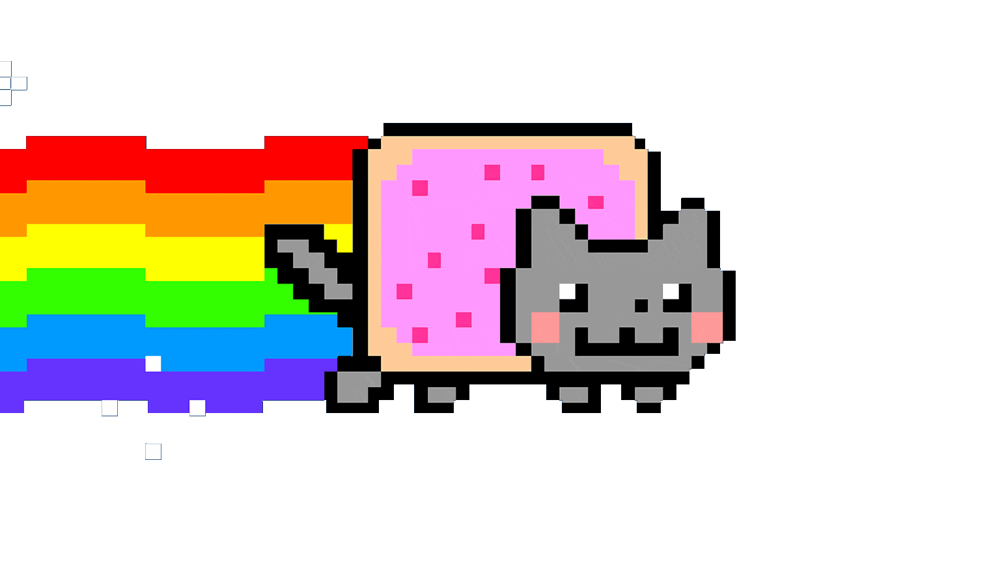

# 🌈 Nyan Cat Desktop

A tiny Electron desktop app that places an animated Nyan Cat on top of all your windows. Press any key or click anywhere and the cat slides to a random spot on your screen.



---

## Features

- Always visible on top of every window (including fullscreen apps on macOS)
- Reacts to **any keypress or mouse click** system-wide — even when another app has focus
- Transparent background — only the cat and rainbow are visible
- Never steals focus from whatever you're working in
- Quit any time via the **menu bar icon** (macOS) or **system tray icon** (Windows)

---

## Requirements

- [Node.js](https://nodejs.org/) v18 or newer
- npm (comes with Node.js)

---

## Installation

```bash
git clone https://github.com/obichris/moving_cat.git
cd moving_cat
npm install
```

---

## Run

```bash
npm start
```

---

## Platform notes

### macOS

On first launch macOS will ask for **Accessibility** permission so the app can listen for global keypresses and clicks.

1. A dialog will appear — click **Open System Settings**
2. In **Privacy & Security → Accessibility**, enable the app (or Terminal if running from there)
3. Quit and relaunch with `npm start`

### Windows

No extra permissions needed. The app works out of the box.

The Nyan Cat icon appears in the **system tray** (bottom-right corner). Right-click it to quit.

---

## Project structure

```
moving_cat/
├── main.js               # Electron main process
├── preload.js            # Secure IPC bridge
├── index.html            # Renderer — cat animation & movement
├── hook-worker.js        # (legacy) Node.js global-hook worker — no longer used
├── nyan_transparent.gif  # Nyan Cat with transparent background
├── nyan.gif              # Original GIF (source)
└── assets/
    └── tray-icon.png     # Menu bar / tray icon
```

---

## How it works

| Part | Details |
|------|---------|
| **Window** | Full-screen, frameless, transparent `BrowserWindow` — always on top, never focusable |
| **Global hooks** | [`uiohook-napi`](https://github.com/SnosMe/uiohook-napi) captures keyboard and mouse events system-wide |
| **Movement** | Main process sends `trigger-move` via IPC → renderer picks a random position → CSS transition slides the cat |
| **Tray** | Single menu-bar / system-tray icon with a Quit option |

---

## License

MIT
